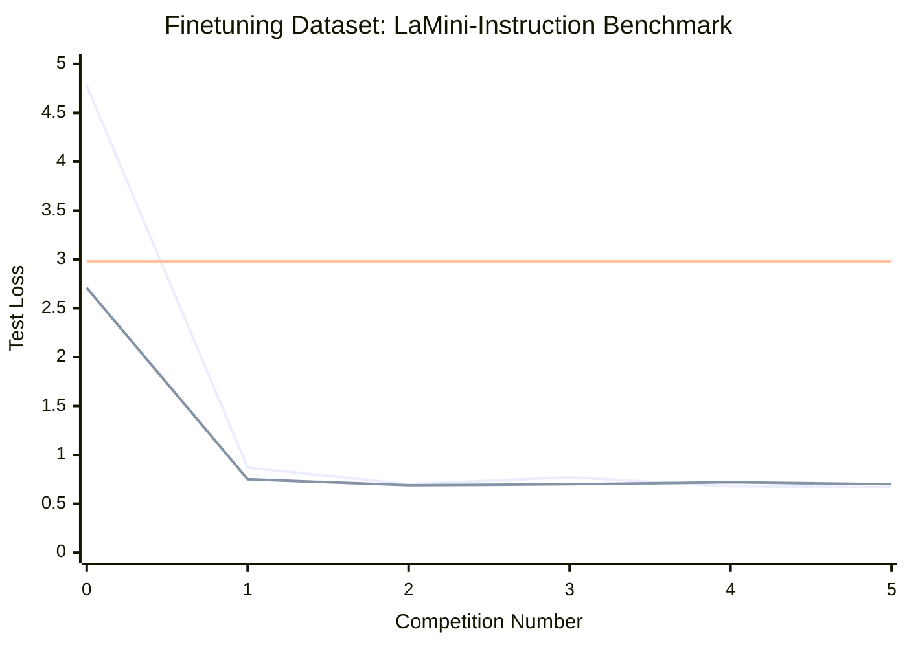
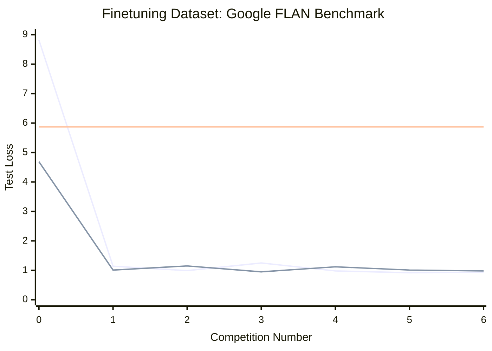
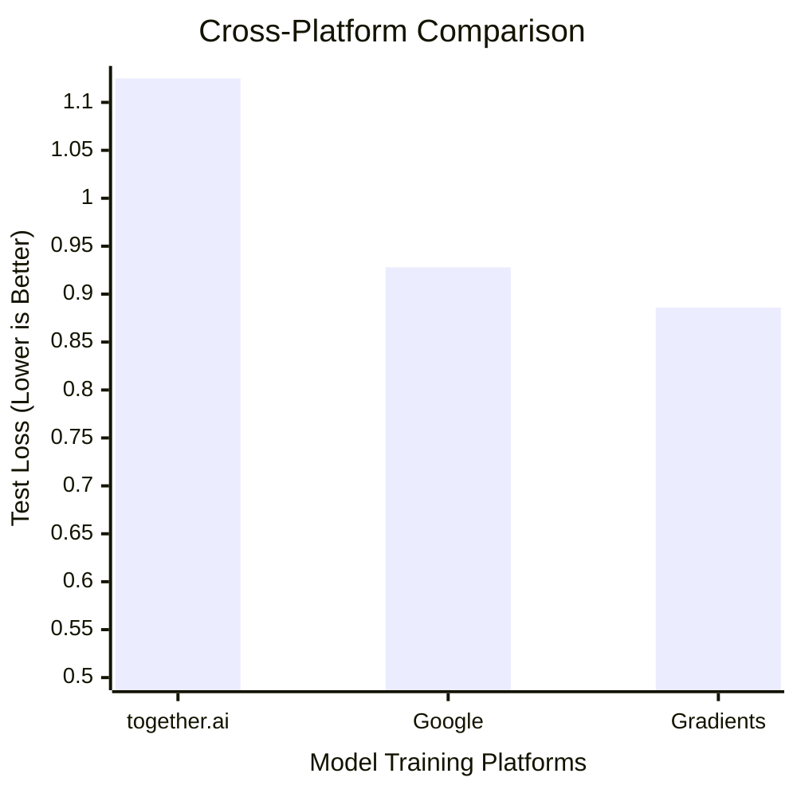

# Gradients.ai makes decentralized AI training a reality: Outperforms Google and TogetherAI on 0 click Model Finetuning

**Date:** 2025-02-14
**Author:** Samoline
## Introduction
Gradients.io is a decentralized AI training platform that allows you to finetune LLMs in a decentralized way. Users just need to pick any model and dataset from Hugging Face, and Gradients.io will take care of the rest!

Miners provide GPU resources and AI expertise to train models in a competitive environment. They're incentivized to achieve the highest quality scores. The winning model within each training job is selected based on test losses and effortlessly made available to the user.

The validators & auditors form a decentralized network that verifies training results, ensures models conformity to the instructions, and maintains the quality of the network. They're also incentivized for accurate validation work, creating a robust quality assurance system.

In just a few weeks from its launch, Gradients.io has already:
1. Processed over **4000 successful training jobs**, with **6-8 successful submissions per job** on average
2. Trained successfully models with sizes summing to over **120,000 Billion parameters**
3. Finetuned successfully on datasets with sizes summing to over **5,400GB of text data**

## Experiments
In this report, we go through experiments showcasing the effectiveness of decentralized AI training through Gradients.io.
### Instruction-tuning competitions
We conducted experiments with two pretrained (non-finetuned) LLMs models of size 3B parameters:
1. Llama 3.2
2. SN9 [winner model](https://huggingface.co/samoline/tensoralchemistdev01__sv17-with-tokenizer)

We finetuned these models using Gradients.io on two popular instruction-tuning datasets.
In the below graphs:
1. 🔵: Llama 3.2
2. 🟢: SN9
3. 🔴: Llama-instruct 3.2 (instruction-tuned by Meta)

Our experiments show that:
1. **Superior Performance**: Both models trained on Gradients.io instruction-tuned (shown as horizontal lines in the graphs).
2. **User Friendly**: Gradients.io is easy to use and requires no specialized knowledge of AI, with just a browser and a few clicks you can finetune a model in an optimized way thanks to decentralization and the incentive mechanisms.
3. **Competitive Results**: [SN9](https://www.macrocosmos.ai/sn9/dashboard?competition=2) decentralized pretrained model demonstrated performance competitive to that of Meta's LLaMA.
4. **Continuous Improvement**: Multiple training competitions showed incremental improvements in model performance, with test loss generally decreasing over successive competitions.

These results demonstrate that decentralized AI training through Gradients.io can effectively improve model performance beyond traditional instruction tuning methods, while maintaining competitive performance across different model architectures.

### Platforms comparison

This graph demonstrates that Gradients.io is able to **outperform other platforms** in 0-click model training setups.

## Conclusion
We are confident that decentralized AI training through Gradients.io will become the standard for AI training in the future. By focusing on an efficient and competitive incentive mechanism, Gradients.io is able to attract a large number of skilled participants to the network, ensuring the best quality of the models rendered to the users.
This way, AI skills and large amounts of GPU resources are all left up to specialized participants, while the users can focus on their own use case.

### Future Work
We are constantly working on improving the platform and adding new features.
**Bonus:** Support for vision models should be available **SOON**, stay tuned!

