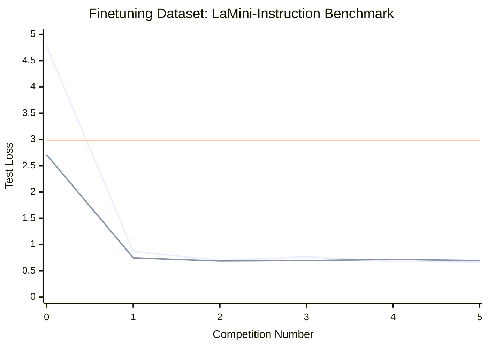
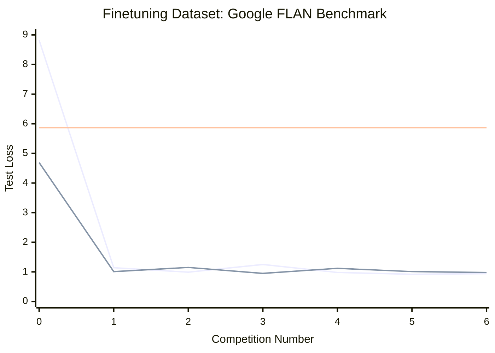

# Gradients.ai makes decentralized AI training possible

**Date:** 2025-02-14
**Author:** Samoline

## Introduction
In this report, we present the effectiveness of decentralized AI training using Gradients.io. To that end, we conducted experiments with two pretrained (non-finetuned) LLMs models of size 3B parameters:
1. Llama 3.2
2. SN9 [winner model](https://huggingface.co/samoline/tensoralchemistdev01__sv17-with-tokenizer)

We finetuned these models using Gradients.io on two popular instruction-tuning datasets.
## Results
In the below graphs:
1. 🔵: Llama 3.2
2. 🟢: SN9
3. 🔴: Llama-instruct 3.2 (instruction-tuned by Meta)

## Key Findings
Our experiments show that:
1. **Superior Performance**: Both models trained on Gradients.io instruction-tuned (shown as horizontal lines in the graphs).
2. **User Friendly**: Gradients.io is easy to use and requires no specialized knowledge of AI, with just a browser and a few clicks you can finetune a model in an optimized way thanks to decentralization and the incentive mechanisms.
3. **Competitive Results**: [SN9](https://www.macrocosmos.ai/sn9/dashboard?competition=2) decentralized pretrained model demonstrated performance competitive to that of Meta's LLaMA.
4. **Continuous Improvement**: Multiple training competitions showed incremental improvements in model performance, with test loss generally decreasing over successive competitions.

These results demonstrate that decentralized AI training through Gradients.io can effectively improve model performance beyond traditional instruction tuning methods, while maintaining competitive performance across different model architectures.

